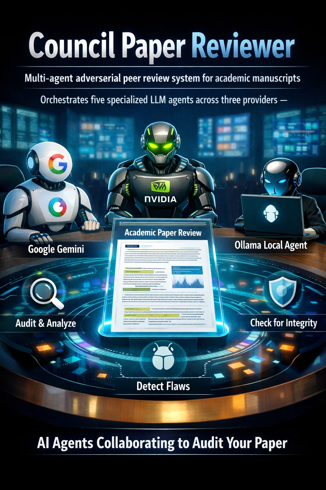

# Council Paper Reviewer

<p align="center">
  
</p>

Multi-agent adversarial peer review system for academic manuscripts. Orchestrates five specialized LLM agents across three providers — Google Gemini, NVIDIA Nemotron, and local Ollama — to audit a paper before human submission.

## The Council

| Role | Model | Provider | Purpose |
|------|-------|----------|---------|
| **Context King** | `gemini-3.1-pro-preview` | Google Gemini | Deep manuscript reasoning with explicit SDK caching. Runs two passes: coherence + rejection risk. |
| **Web Research** | `gemini-2.5-flash` | Google Gemini | Web-grounded journal fit and recent related-work gap analysis. |
| **Logic Judge** | `nemotron-3-super-120b-a12b` | NVIDIA Nemotron | Hostile logic and statistics audit across the full paper. |
| **Technical Auditor** | `nemotron-3-super-120b-a12b` | NVIDIA Nemotron | Code, math, and reproducibility checks. |
| **Style Scribe** | `qwen3:8b` | Ollama (local) | Prose polish, LaTeX cleanup, AI-residue detection. |

## Why not just paste the paper into three LLMs?

You can — but you'll get polite, surface-level feedback. General-purpose LLMs asked to "review this paper" optimize for helpful-sounding output, not for breaking it.

**What this system does differently:**

- **Adversarial charters, not review requests.** The Logic Judge is not asked to review — it is prompted to *attack* the logical chain, hunt for overclaiming, and produce blockers. Specialized hostile framing produces qualitatively different findings than "please review."

- **Evidence-backed retrieval.** The bundle system doesn't dump your whole paper at every agent. It retrieves the *relevant chunks per role* — statistics sections to the Logic Judge, equations to the Technical Auditor. Large papers especially benefit from this.

- **Domain calibration cuts false positives.** A generic LLM will flag small effect sizes as a weakness. With calibration, the agent knows that's normal in your field and targets *overclaiming* instead — the actual problem. Generic reviews produce noise that wastes your time.

- **Structured JSON output with locations.** Every finding includes a location, issue, and fix instruction. You can track what you fixed between runs. Browser-tab reviews give you prose you re-read manually.

- **External evidence ingestion.** The Technical Auditor can read your companion repo — code, data scripts, evaluation app — alongside the paper, and check whether what you *claim* about your implementation matches what the code *does*. No chat session does this.

- **Completeness guarantee.** The pipeline is fail-fast: you get a full audit or a clear failure, not three partial responses you have to manually synthesize.

## Quick Start

```bash
# 1. Install dependencies
pip install -r council_reviewer/requirements.txt

# 2. Configure API keys
cp .env.example .env
# Edit .env — fill in GEMINI_API_KEY and NVIDIA_API_KEY

# 3. Configure your manuscript
cp council_reviewer/manuscript.example.json council_reviewer/manuscript.json
# Edit manuscript.json — set target_repo, target_journal, and paths

# 4. Start Ollama with required models
ollama pull qwen3:8b && ollama pull gemma3:4b && ollama pull nomic-embed-text

# 5. Run pre-flight diagnostics (no LLM calls)
cd council_reviewer && python3 run_local_aipeer_review.py --doctor-only

# 6. Run the full review
cd council_reviewer && python3 run_local_aipeer_review.py
```

## Domain Calibration

The council prompts can be tuned for your research domain via a `domain_calibration` block in `manuscript.json`. This lets you inject domain-specific review rules — expected effect size ranges, methodology conventions, formatting targets — without touching Python.

A working example for speech synthesis / TTS research is provided in `examples/manuscript_tts.example.json`. The calibration schema is documented in `council_reviewer/README.md`.

## Outputs

All artifacts are written to `council_reviewer/results/<timestamp>/`:

- `CRITIQUE_REPORT.md` — consolidated human-readable report
- `ARCHITECT_PROMPT.md` — structured handoff prompt for a follow-up revision pass
- `context_king.json`, `logic_judge.json`, `technical_auditor.json`, `style_scribe.json` — per-role JSON artifacts

## Resume a Failed Run

```bash
cd council_reviewer && python3 run_local_aipeer_review.py --resume results/2026-03-28_17-10-51/
```

Skips completed agents and reuses cached LLM responses — saves API costs on partial failures.

## Architecture

See `council_reviewer/README.md` for a detailed description of the pipeline, manifest fields, provider configuration, and the non-obvious design patterns (Gemini explicit caching, JSON repair loop, token budget guards).

## Requirements

- Python 3.11+
- [Google AI Studio](https://aistudio.google.com/) API key (Gemini)
- [NVIDIA NIM](https://build.nvidia.com/) API key (Nemotron)
- [Ollama](https://ollama.com/) running locally on port 11434

## License

MIT. Built on concepts from [Agentic-Systems-Lab/rigorous](https://github.com/Agentic-Systems-Lab/rigorous).
